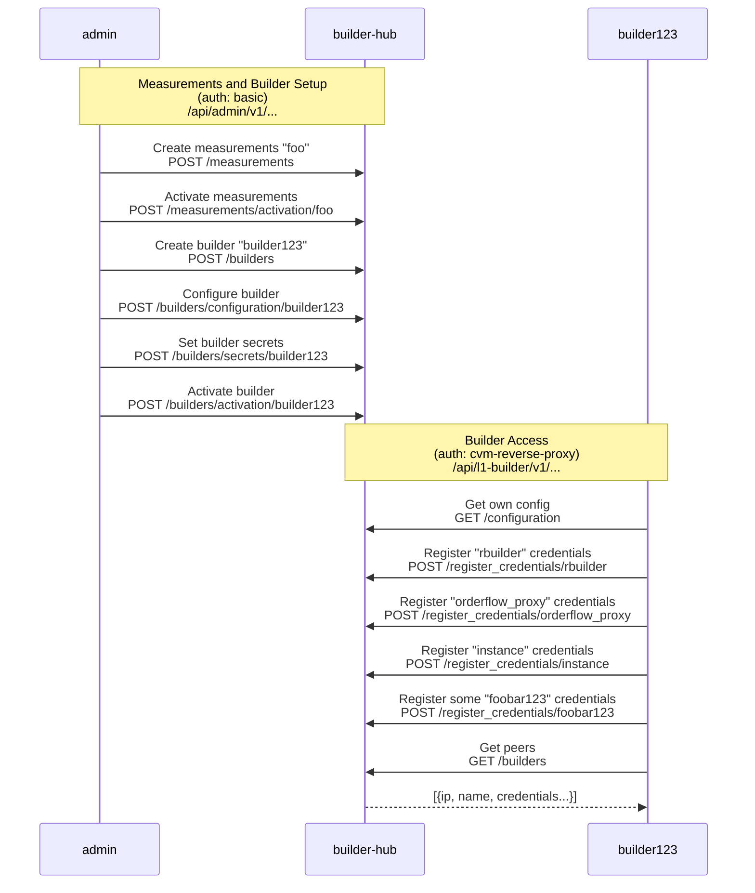

You can load the Bruno collection with https://www.usebruno.com

The docs include these collections:
- [Admin API](./admin-api/)
- [Instance API](./instance-api/)

## Flow

```mermaid
sequenceDiagram
    participant admin as admin
    participant hub as builder-hub
    participant builder as builder123

    Note over admin, hub: Measurements and Builder Setup<br/>(auth: basic)<br/>/api/admin/v1/...
    admin->>hub: Create measurements "foo"<br/>POST /measurements
    admin->>hub: Activate measurements<br/>POST /measurements/activation/foo
    admin->>hub: Create builder "builder123"<br/>POST /builders
    admin->>hub: Configure builder<br/>POST /builders/configuration/builder123
    admin->>hub: Set builder secrets<br/>POST /builders/secrets/builder123
    admin->>hub: Activate builder<br/>POST /builders/activation/builder123

    Note over builder, hub: Builder Access<br/>(auth: cvm-reverse-proxy)<br/>/api/l1-builder/v1/...
    builder->>hub: Get own config<br/>GET /configuration
    builder->>hub: Register "rbuilder" credentials<br/>POST /register_credentials/rbuilder
    builder->>hub: Register "orderflow_proxy" credentials<br/>POST /register_credentials/orderflow_proxy
    builder->>hub: Register "instance" credentials<br/>POST /register_credentials/instance
    builder->>hub: Register some "foobar123" credentials<br/>POST /register_credentials/foobar123
    builder->>hub: Get peers<br/>GET /builders
    hub-->>builder: [{ip, name, credentials...}]
```
